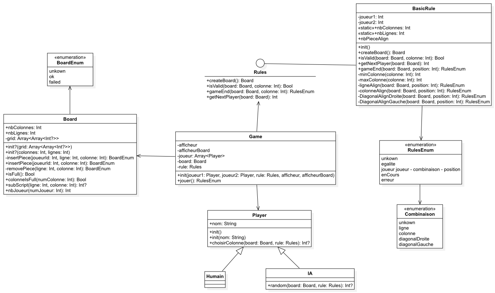

# Puissance4

Bienvenu sur le projet puissance4!

Le puissance 4 est un jeu classique qui se joue à deux joueurs où il faut aligner 4 pions pour gagner.

# Sommaire

- [Puissance 4](#puissance4)
- [Architecture du projet](#architecture_du_projet)
- [Diagramme de classe](#diagramme_de_classe)
- [Requirements](#requirements)
- [Installation](#installation)
    - [Lancement:](#lancement)
- [Déroulement d'une partie](#deroulement_d_une_partie)
- [Auteurs](#auteurs)

# Architecture du projet :

Ce projet est divisé en deux :

-	MyLibrary : package composer des sources du projet et des tests
-	Puissance4 : application console

# Diagramme de classe

[**Diagramme**](https://codefirst.iut.uca.fr/git/maia.perderizet/Puissance4/src/branch/master/Documentation/Diagramme/Diagramme_de_classe.png)

  

## Struct Board:

Cette struct va construire la grille du jeu.

## Classe Player:

Cette classe représente le joueur de la partie.

## Protocole Rules:

Rules est implémenté par les classes ou structs définissant les régles du puissances 4 ou ces variantes.

## Classe Game:

Créer et permet de lancer une partie de puissance 4.
Une partie est composé de 2 joueurs, d'un board et d'une règle.

# Requirements

Le projet est en **swift**, je vous conseille de le lancé sur **xcode**.

# Installation

Cloné le dépôt du projet: ```git clone https://codefirst.iut.uca.fr/git/maia.perderizet/Puissance4.git```.

## Lancement:

- Ouvrir la solution dans xcode.
- Lancer l'application console: Puissance4

# Déroulement d'une partie

Pour lancer une partie lancer l'application console via **xcode**.

Vous pourrais choisir entre plusieur IA et une personne.

# Auteurs
Maïa PERDERIZET

_Generated with a_ **Code#0** _template_  
   
